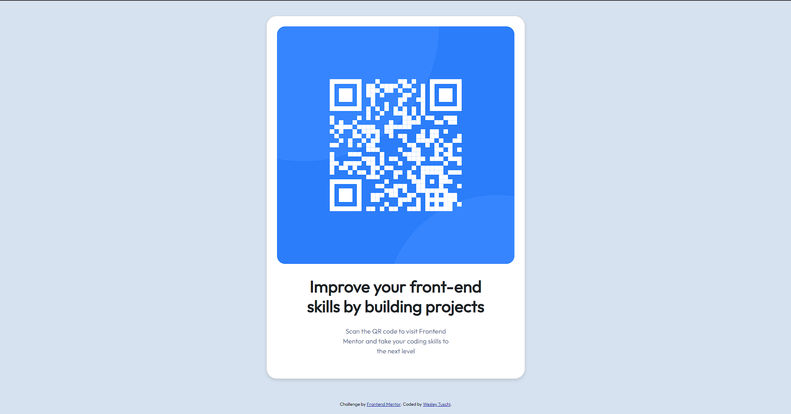

# Frontend Mentor - QR code component solution

This is a solution to the [QR code component challenge on Frontend Mentor](https://www.frontendmentor.io/challenges/qr-code-component-iux_sIO_H). Frontend Mentor challenges help you improve your coding skills by building realistic projects. 

## Table of contents

- [Overview](#overview)
  - [Screenshot](#screenshot)
  - [Links](#links)
  - [Built with](#built-with)

## Overview

### Screenshot

### Links

- Live Site URL:(https://qr-code-front-xi.vercel.app/)

### Built with

- Semantic HTML5 markup
- CSS custom properties
- Flexbox
- [GSAP](https://greensock.com/gsap/)
- [Bootstrap](https://getbootstrap.com/)
